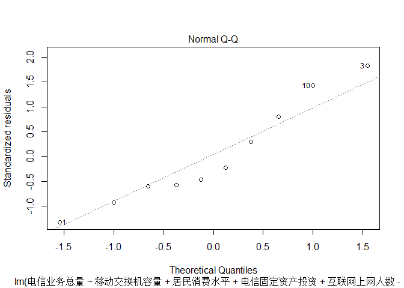
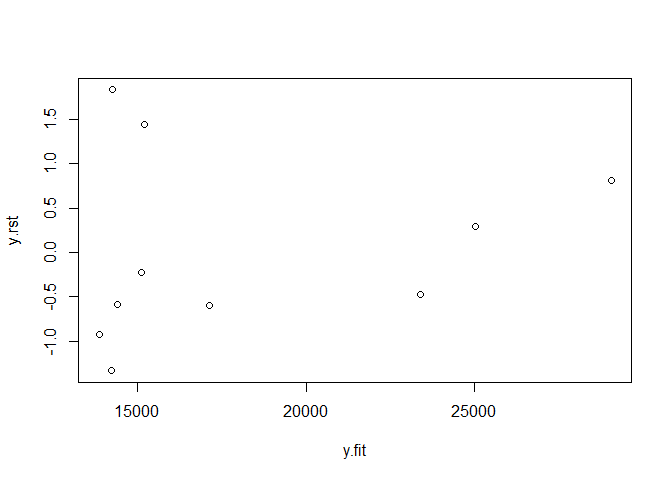

# 电信业务总量影响因素分析

###1.查找文献，获得影响因素，并从国家统计局网站获取数据

###2.读取数据，并进行多元回归


```r
dat<-read.csv("Q:/data1.csv")
dat<-dat[,-1]
cor(dat)  #计算变量间的相关性
```

```
##                  局用交换机容量 移动交换机容量         GDP 居民消费水平
## 局用交换机容量        1.0000000     -0.7672949 -0.86865937  -0.88938353
## 移动交换机容量       -0.7672949      1.0000000  0.97357383   0.96125159
## GDP                  -0.8686594      0.9735738  1.00000000   0.99827694
## 居民消费水平         -0.8893835      0.9612516  0.99827694   1.00000000
## 人口                 -0.8399612      0.9855163  0.99589527   0.99088826
## 电信固定资产投资      0.8630395     -0.7549987 -0.84449164  -0.85340705
## 互联网上网人数       -0.8108396      0.9955299  0.98639795   0.97684354
## 电信业务总量          0.2394299      0.1124142 -0.03398902  -0.07198107
##                         人口 电信固定资产投资 互联网上网人数 电信业务总量
## 局用交换机容量   -0.83996117        0.8630395    -0.81083961   0.23942994
## 移动交换机容量    0.98551629       -0.7549987     0.99552990   0.11241417
## GDP               0.99589527       -0.8444916     0.98639795  -0.03398902
## 居民消费水平      0.99088826       -0.8534070     0.97684354  -0.07198107
## 人口              1.00000000       -0.8024829     0.99234126   0.04529298
## 电信固定资产投资 -0.80248286        1.0000000    -0.80360160   0.38790799
## 互联网上网人数    0.99234126       -0.8036016     1.00000000   0.07586396
## 电信业务总量      0.04529298        0.3879080     0.07586396   1.00000000
```

```r
fit1<-lm(电信业务总量~.,data=dat)
summary(fit1)
```

```
## 
## Call:
## lm(formula = 电信业务总量 ~ ., data = dat)
## 
## Residuals:
##        1        2        3        4        5        6        7        8 
##   680.99 -2415.39  2207.13   -20.96   -49.14   164.85  -725.61  -101.18 
##        9       10 
##   -86.45   345.77 
## 
## Coefficients:
##                    Estimate Std. Error t value Pr(>|t|)
## (Intercept)      -2.629e+06  1.375e+06  -1.912    0.196
## 局用交换机容量   -1.741e-01  6.348e-01  -0.274    0.810
## 移动交换机容量   -8.148e-01  3.064e-01  -2.660    0.117
## GDP              -8.413e-02  2.940e-01  -0.286    0.802
## 居民消费水平     -7.750e+00  7.982e+00  -0.971    0.434
## 人口              2.056e+01  1.074e+01   1.915    0.196
## 电信固定资产投资  3.683e+01  1.905e+01   1.933    0.193
## 互联网上网人数    2.758e+00  1.160e+00   2.378    0.141
## 
## Residual standard error: 2435 on 2 degrees of freedom
## Multiple R-squared:  0.9655,	Adjusted R-squared:  0.8449 
## F-statistic: 8.002 on 7 and 2 DF,  p-value: 0.1155
```

```r
fit2<-lm(电信业务总量~.-1,data=dat)
summary(fit2)
```

```
## 
## Call:
## lm(formula = 电信业务总量 ~ . - 1, data = dat)
## 
## Residuals:
##       1       2       3       4       5       6       7       8       9 
##  -965.3  -791.6  3895.5 -2920.7  1000.6  1196.6 -1822.6   226.3 -1022.4 
##      10 
##  1195.2 
## 
## Coefficients:
##                   Estimate Std. Error t value Pr(>|t|)  
## 局用交换机容量    -0.35862    0.86140  -0.416   0.7052  
## 移动交换机容量    -0.82881    0.42052  -1.971   0.1433  
## GDP                0.23496    0.33224   0.707   0.5304  
## 居民消费水平     -11.06144   10.69802  -1.034   0.3772  
## 人口               0.04272    0.38087   0.112   0.9178  
## 电信固定资产投资  63.28960   17.96513   3.523   0.0388 *
## 互联网上网人数     3.19970    1.56041   2.051   0.1327  
## ---
## Signif. codes:  0 '***' 0.001 '**' 0.01 '*' 0.05 '.' 0.1 ' ' 1
## 
## Residual standard error: 3344 on 3 degrees of freedom
## Multiple R-squared:  0.9907,	Adjusted R-squared:  0.9691 
## F-statistic:  45.8 on 7 and 3 DF,  p-value: 0.004782
```
###3.通过上述拟合模型比较，我们考虑到存在变量间存在相关性，并进行逐步回归


```r
step(fit1,direction = "both")
```

```
## Start:  AIC=155.86
## 电信业务总量 ~ 局用交换机容量 + 移动交换机容量 + GDP + 居民消费水平 + 
##     人口 + 电信固定资产投资 + 互联网上网人数
## 
##                    Df Sum of Sq      RSS    AIC
## - 局用交换机容量    1    446069 12309161 154.23
## - GDP               1    485849 12348941 154.26
## <none>                          11863092 155.86
## - 居民消费水平      1   5590998 17454090 157.72
## - 人口              1  21756280 33619372 164.28
## - 电信固定资产投资  1  22172542 34035634 164.40
## - 互联网上网人数    1  33540838 45403930 167.28
## - 移动交换机容量    1  41956972 53820063 168.99
## 
## Step:  AIC=154.23
## 电信业务总量 ~ 移动交换机容量 + GDP + 居民消费水平 + 人口 + 电信固定资产投资 + 
##     互联网上网人数
## 
##                    Df Sum of Sq      RSS    AIC
## - GDP               1   1646694 13955856 153.49
## <none>                          12309161 154.23
## + 局用交换机容量    1    446069 11863092 155.86
## - 居民消费水平      1   6818000 19127161 156.64
## - 电信固定资产投资  1  21890888 34200050 162.45
## - 人口              1  22934553 35243714 162.75
## - 互联网上网人数    1  49870134 62179295 168.43
## - 移动交换机容量    1  61813985 74123146 170.19
## 
## Step:  AIC=153.49
## 电信业务总量 ~ 移动交换机容量 + 居民消费水平 + 人口 + 电信固定资产投资 + 
##     互联网上网人数
## 
##                    Df Sum of Sq      RSS    AIC
## <none>                          13955856 153.49
## + GDP               1   1646694 12309161 154.23
## + 局用交换机容量    1   1606915 12348941 154.26
## - 人口              1  24897931 38853786 161.73
## - 电信固定资产投资  1  34880826 48836682 164.01
## - 互联网上网人数    1  48778220 62734076 166.52
## - 居民消费水平      1  59821827 73777683 168.14
## - 移动交换机容量    1  65225062 79180918 168.85
```

```
## 
## Call:
## lm(formula = 电信业务总量 ~ 移动交换机容量 + 居民消费水平 + 人口 + 
##     电信固定资产投资 + 互联网上网人数, data = dat)
## 
## Coefficients:
##      (Intercept)    移动交换机容量      居民消费水平              人口  
##       -2.265e+06        -8.737e-01        -8.948e+00         1.763e+01  
## 电信固定资产投资    互联网上网人数  
##        4.109e+01         2.876e+00
```

```r
fit1_1<-lm(电信业务总量 ~ 移动交换机容量 + 居民消费水平 + 人口 + 
    电信固定资产投资 + 互联网上网人数, data = dat)
summary(fit1_1)
```

```
## 
## Call:
## lm(formula = 电信业务总量 ~ 移动交换机容量 + 居民消费水平 + 人口 + 
##     电信固定资产投资 + 互联网上网人数, data = dat)
## 
## Residuals:
##       1       2       3       4       5       6       7       8       9 
##  1063.9 -2403.9  1981.9  -812.0   739.3   135.5  -749.2  -346.0  -558.5 
##      10 
##   948.9 
## 
## Coefficients:
##                    Estimate Std. Error t value Pr(>|t|)  
## (Intercept)      -2.265e+06  8.431e+05  -2.687   0.0549 .
## 移动交换机容量   -8.737e-01  2.021e-01  -4.324   0.0124 *
## 居民消费水平     -8.948e+00  2.161e+00  -4.141   0.0144 *
## 人口              1.763e+01  6.601e+00   2.671   0.0557 .
## 电信固定资产投资  4.109e+01  1.299e+01   3.162   0.0341 *
## 互联网上网人数    2.876e+00  7.691e-01   3.739   0.0201 *
## ---
## Signif. codes:  0 '***' 0.001 '**' 0.01 '*' 0.05 '.' 0.1 ' ' 1
## 
## Residual standard error: 1868 on 4 degrees of freedom
## Multiple R-squared:  0.9594,	Adjusted R-squared:  0.9088 
## F-statistic: 18.93 on 5 and 4 DF,  p-value: 0.006906
```


```r
step(fit2,direction = "both")
```

```
## Start:  AIC=164.26
## 电信业务总量 ~ (局用交换机容量 + 移动交换机容量 + GDP + 居民消费水平 + 
##     人口 + 电信固定资产投资 + 互联网上网人数) - 1
## 
##                    Df Sum of Sq       RSS    AIC
## - 人口              1    140688  33684215 162.30
## - 局用交换机容量    1   1938029  35481556 162.82
## - GDP               1   5592285  39135812 163.80
## <none>                           33543527 164.26
## - 居民消费水平      1  11953750  45497277 165.31
## - 移动交换机容量    1  43432169  76975696 170.56
## - 互联网上网人数    1  47014010  80557537 171.02
## - 电信固定资产投资  1 138768686 172312213 178.62
## 
## Step:  AIC=162.3
## 电信业务总量 ~ 局用交换机容量 + 移动交换机容量 + GDP + 居民消费水平 + 
##     电信固定资产投资 + 互联网上网人数 - 1
## 
##                    Df Sum of Sq       RSS    AIC
## - GDP               1   6412865  40097081 162.04
## <none>                           33684215 162.30
## - 局用交换机容量    1  10556099  44240314 163.03
## + 人口              1    140688  33543527 164.26
## - 居民消费水平      1  17525388  51209603 164.49
## - 移动交换机容量    1  64354167  98038382 170.98
## - 互联网上网人数    1  68658572 102342787 171.41
## - 电信固定资产投资  1 158527045 192211260 177.72
## 
## Step:  AIC=162.04
## 电信业务总量 ~ 局用交换机容量 + 移动交换机容量 + 居民消费水平 + 
##     电信固定资产投资 + 互联网上网人数 - 1
## 
##                    Df Sum of Sq       RSS    AIC
## - 局用交换机容量    1   6594710  46691791 161.56
## <none>                           40097081 162.04
## + GDP               1   6412865  33684215 162.30
## + 人口              1    961269  39135812 163.80
## - 移动交换机容量    1  62971651 103068732 169.48
## - 互联网上网人数    1 100750088 140847169 172.61
## - 居民消费水平      1 123980963 164078043 174.13
## - 电信固定资产投资  1 152116438 192213519 175.72
## 
## Step:  AIC=161.56
## 电信业务总量 ~ 移动交换机容量 + 居民消费水平 + 电信固定资产投资 + 
##     互联网上网人数 - 1
## 
##                    Df Sum of Sq       RSS    AIC
## <none>                           46691791 161.56
## + 人口              1   7554596  39137195 161.80
## + 局用交换机容量    1   6594710  40097081 162.04
## + GDP               1   2451477  44240314 163.03
## - 移动交换机容量    1  64263230 110955021 168.22
## - 互联网上网人数    1 104243373 150935164 171.30
## - 居民消费水平      1 161815545 208507336 174.53
## - 电信固定资产投资  1 246293806 292985597 177.93
```

```
## 
## Call:
## lm(formula = 电信业务总量 ~ 移动交换机容量 + 居民消费水平 + 电信固定资产投资 + 
##     互联网上网人数 - 1, data = dat)
## 
## Coefficients:
##   移动交换机容量      居民消费水平  电信固定资产投资    互联网上网人数  
##          -0.8524           -4.4570           51.8410            3.7357
```

```r
fit2_1<-lm(电信业务总量 ~ 移动交换机容量 + 居民消费水平 + 电信固定资产投资 + 
    互联网上网人数 - 1, data = dat)
summary(fit2_1)
```

```
## 
## Call:
## lm(formula = 电信业务总量 ~ 移动交换机容量 + 居民消费水平 + 电信固定资产投资 + 
##     互联网上网人数 - 1, data = dat)
## 
## Residuals:
##     Min      1Q  Median      3Q     Max 
## -2811.1 -1412.1  -822.3   849.7  4331.9 
## 
## Coefficients:
##                  Estimate Std. Error t value Pr(>|t|)   
## 移动交换机容量    -0.8524     0.2966  -2.874  0.02829 * 
## 居民消费水平      -4.4570     0.9774  -4.560  0.00385 **
## 电信固定资产投资  51.8410     9.2149   5.626  0.00135 **
## 互联网上网人数     3.7357     1.0207   3.660  0.01058 * 
## ---
## Signif. codes:  0 '***' 0.001 '**' 0.01 '*' 0.05 '.' 0.1 ' ' 1
## 
## Residual standard error: 2790 on 6 degrees of freedom
## Multiple R-squared:  0.9871,	Adjusted R-squared:  0.9785 
## F-statistic: 114.7 on 4 and 6 DF,  p-value: 8.512e-06
```

###4.在fit2_1的基础上做回归诊断

####(1)残差正态性检验

```r
y_res<-resid(fit2_1)
shapiro.test(y_res)
```

```
## 
## 	Shapiro-Wilk normality test
## 
## data:  y_res
## W = 0.91799, p-value = 0.3405
```

```r
plot(fit2_1,2)  ##正太Q-Q图
```

 

#####(2)标准化的残差散点图(看残差方差是否相等)

```r
y.rst<-rstandard(fit2_1)
y.fit<-predict(fit2_1)
plot(y.rst~y.fit)
```

 


综上，最终模型使用的是fit2_1模型

